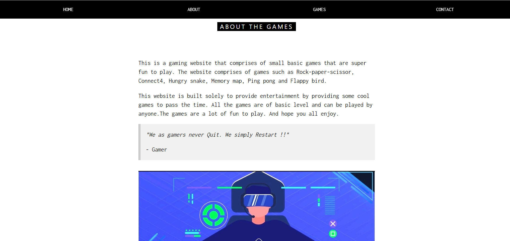

# Gamecafe
A website built using basic HTMl and CSS which is a gaming website.
The games comprised are built using HTMl, CSS and Vanilla JavaScript.

The games that are put into the website are
* Rock-Paper-Scissor
* Ping Pong
* Hungry Snake
* Memory Map
* Connect-4
* Flappy Bird

to play the games or to use it as a mini project follow the steps
1. clone the repo
2. run the index.html file 
3. you are ready with website
4. if u want to play the game then click the start button

Each game has its rules
TO play the game go to the games section and click start button and play the game.

# A look of the website

Have fun :)

